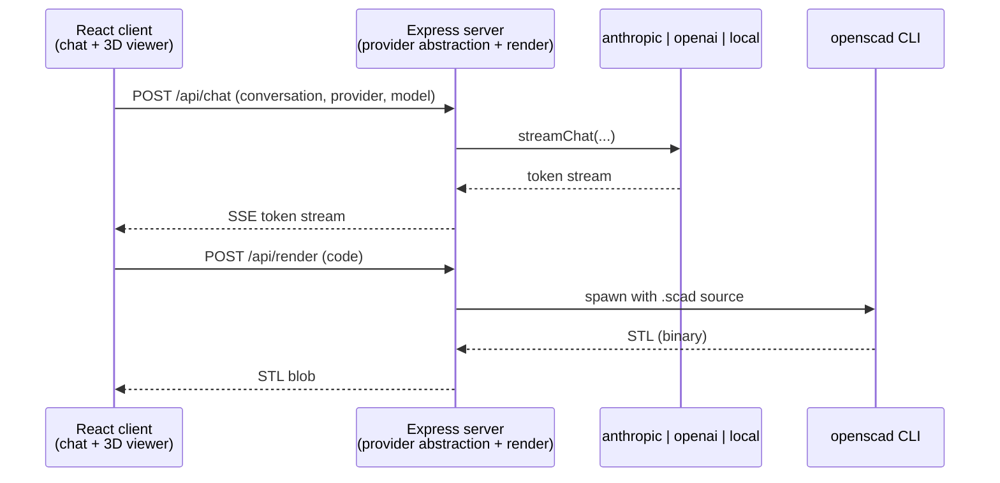

<p align="center">
  
</p>

<h1 align="center">Text2SCAD</h1>
<p align="center"><strong>Describe it. Make it.</strong></p>

<p align="center">
  
  
  
  
  
  
</p>

Chat with an LLM to describe a 3D object in plain English, get back real OpenSCAD source, and watch it render live in an interactive 3D viewer. Ask for changes — "make the handle thicker", "add a hole through the base" — and the model updates in place. Bring your own provider: Claude, OpenAI, or a small Hugging Face model running right on the server (no API key) — or [bring your own API key](#bring-your-own-api-key) and talk to Anthropic/OpenAI straight from your browser, with our server never in the request path at all. There's also a [GitHub Pages demo](#github-pages-demo) that runs entirely client-side — an SLM and the OpenSCAD engine itself, both compiled to WebAssembly, running in your browser with no backend at all.

## Demo


*Recorded end-to-end with the real app — see [`scripts/record-demo.mjs`](scripts/record-demo.mjs).*

## Quickstart

```bash
npm install                       # installs server + client workspaces
cp server/.env.example server/.env
# edit server/.env and set ANTHROPIC_API_KEY (or switch LLM_PROVIDER — see Configuration)
npm run dev
```

Opens the Express API on `http://localhost:3001` and the Vite client on `http://localhost:5173` (proxies `/api/*` to the backend). Requires the [`openscad`](https://openscad.org/downloads.html) CLI on `PATH`. By default it uses Claude (`ANTHROPIC_API_KEY`), but a dropdown in the chat toolbar lets you switch provider/model per request — including `local`, which runs a small Hugging Face model right in the Node process with no API key at all.

Chat history is saved to the browser's `localStorage` (a sidebar lists past conversations — new/switch/rename/delete), so refreshing the page doesn't lose your work. The server itself stays stateless; the full history is just resent with each request.

## How it works



- **Chat → code**: the client streams the conversation to `POST /api/chat`, along with the provider/model chosen in the toolbar; `server/src/lib/providers/index.js` picks the right backend (`anthropic.js`, `openai.js`, or `local.js`), which replies with a short explanation plus one ` ```scad ` block, streamed back over SSE token-by-token. `GET /api/providers` reports which providers/models are actually available (e.g. `openai` is hidden/disabled unless `OPENAI_API_KEY` is set) so the client can build the picker dynamically.
- **Code → 3D**: each code block is posted to `POST /api/render`, which shells out to the real `openscad` binary for a binary STL, parsed client-side with three.js's `STLLoader` and shown via `@react-three/fiber`.
- Because rendering uses the real OpenSCAD CLI (not a JS reimplementation), the full OpenSCAD language and its exact rendering behavior are supported. The `local` provider is the odd one out: it isn't vision-capable, so `POST /api/critique` (below) returns a `501` when it's active.

### Optimizations

Raw LLM-generated CSG code is prone to a specific failure: geometry that's syntactically valid but doesn't look like what was asked for (a floating handle, a foot that misses the ground) — and the model never sees a render of its own output. Three cheapest-first layers catch this:

| Layer | How it works | Why it works |
|---|---|---|
| **Curated helpers**<br>`helperLibrary.js` | Pre-verified modules (`rounded_box`, `capsule`, `tube`, `torus_arc`) prepended to every render, plus an "overlap, don't just touch" system-prompt rule. | Removes the need to hand-derive fragile transform math for every attachment — cheapest fix, applied on every turn. |
| **Mechanical connectivity check**<br>`meshAnalysis.js` | Union-find over shared STL vertices reports disconnected-piece count via an `X-Component-Count` header. If a part is genuinely floating, the client auto-sends a corrective follow-up (up to 2 attempts). | Catches truly disconnected geometry cheaply and automatically. Won't catch a part that's connected but shaped/oriented wrong — OpenSCAD's own `Volumes:` line looks like it'd help but reports the same count for a hollow object as for two separate ones, so it isn't used. |
| **Visual critique** (opt-in)<br>`POST /api/critique` | Renders a PNG snapshot server-side (OpenSCAD's fast OpenCSG preview path) and asks Claude, with vision, to judge and fix it. | The only layer that actually "looks" at the object, so it's the one that catches proportion/orientation defects. Opt-in since it costs a render + an extra model call. |

Multi-object scenes (a house plus trees plus animals) are the other bottleneck: STL export resolves every boolean exactly via CGAL, which scales badly once `hull()`-heavy helpers are involved. Measured on one representative scene: **2m 5s** naive → **2.3s** with `$fn` capped → **~1s** decomposed into parts.

| Optimization | How it works | Why it works |
|---|---|---|
| **Draft vs. final quality**<br>`openscadRenderer.js` | Every chat-turn render uses `quality: "draft"`, which caps `$fn` via a text-level substitution over literal `$fn=N` occurrences. Downloads trigger a fresh `quality: "final"` render on demand. | A CLI `-D` override alone doesn't work here: a per-primitive `$fn=24` (normal, idiomatic OpenSCAD, and what the system prompt itself encourages) always shadows a CLI default, so only a source-level substitution reliably caps detail. |
| **Scene decomposition**<br>`sceneParts.js` + `meshMerge.js` | The system prompt asks the model to mark independent top-level objects with a `// ===== SCENE PARTS =====` convention. Each part renders in its own temp file, in parallel (`SCENE_PART_CONCURRENCY`, default 4), and the STLs are concatenated directly. | Non-overlapping parts just need their triangle lists merged — no CGAL boolean required. The realism auto-fix also skips its disconnected-component check here, since multiple components is the correct topology for a scene. |

## Configuration

`server/.env` (see `server/.env.example`):

| Variable | Default | Description |
|---|---|---|
| `LLM_PROVIDER` | `anthropic` | `anthropic` \| `openai` \| `local` — which backend generates/refines code |
| `ANTHROPIC_API_KEY` | — | required when `LLM_PROVIDER=anthropic` |
| `CHAT_MODEL` | `claude-sonnet-5` | Anthropic model used to generate/refine OpenSCAD code |
| `OPENAI_API_KEY` | — | required when `LLM_PROVIDER=openai` |
| `OPENAI_CHAT_MODEL` | `gpt-4o-mini` | OpenAI model used when `LLM_PROVIDER=openai` |
| `LOCAL_MODEL` | `onnx-community/Qwen2.5-Coder-0.5B-Instruct` | Hugging Face model id run in-process via [transformers.js](https://huggingface.co/docs/transformers.js) when `LLM_PROVIDER=local` — no API key, downloaded once and cached |
| `LOCAL_MODEL_DTYPE` | `q4` | ONNX quantization for the local model (CPU-friendly; browser/WebGPU builds use `q4f16` instead — see the standalone site below) |
| `LOCAL_MAX_NEW_TOKENS` | `2048` | generation cap for the local provider |
| `PORT` | `3001` | Express server port |
| `OPENSCAD_BIN` | `openscad` | path to the OpenSCAD binary |
| `RENDER_TIMEOUT_MS` | `20000` | kills a "draft" quality render past this long |
| `RENDER_TIMEOUT_MS_FINAL` | `90000` | kills a "final" quality render (on-demand, e.g. downloads) |
| `DRAFT_FN` | `8` | `$fn` cap applied to draft-quality renders |
| `SCENE_PART_CONCURRENCY` | `4` | how many SCENE PARTS to render in parallel |

`client/.env` only matters if you change the server's `PORT` — set `VITE_BACKEND_PORT` to match, since the dev server proxies `/api/*` to it (and uses `strictPort`, so it fails loudly instead of silently moving off `5173`).

## Bring your own API key

The provider picker also offers **"Anthropic (your key)"** and **"OpenAI (your key)"** — available in both the Express-backed app and the GitHub Pages standalone build. These work completely differently from the server-configured `anthropic`/`openai` providers above: your key is stored only in this browser's `localStorage` (`client/src/byok/keyStore.ts`), and every request goes **straight from your browser to Anthropic's/OpenAI's own API** (`client/src/byok/anthropicBackend.ts` / `openaiBackend.ts`, using their SDKs' `dangerouslyAllowBrowser` mode) — our server is never in that request path at all, so there's nothing to intercept even if you don't trust it.

This is genuinely how it works, not just policy: both providers' APIs support direct cross-origin browser calls (verified — Anthropic sends `access-control-allow-origin: *`, OpenAI reflects the request's `Origin`), so `fetch`/the SDK really does talk to `api.anthropic.com`/`api.openai.com` directly, with no proxy in between. The usual caveat for any client-side-stored secret still applies: it's readable by other JS running on the same page (a compromised dependency, a browser extension with page access), so don't paste in a key you wouldn't want exposed to whatever else is running in your browser — same as any other API playground you'd paste a key into.

Visual critique isn't wired up for BYOK yet (it needs a rendered PNG snapshot; the standalone build's OpenSCAD-WASM only exports STL, and doing it via the Express server would mean the snapshot round-trips through our backend even though the vision call itself wouldn't) — that button shows an explanatory error under these providers for now.

## GitHub Pages demo

GitHub Pages only serves static files — there's no Express server and no `openscad` CLI to shell out to. Rather than skip the "watch it render live" centerpiece of the app, the standalone build moves *everything* into the browser:

| Piece | How it works |
|---|---|
| **Chat (SLM)** | A small Hugging Face model runs client-side via [transformers.js](https://huggingface.co/docs/transformers.js), WebGPU-accelerated where available (falls back to WASM automatically). `client/src/components/ProviderModelPicker.tsx` offers a choice of models (`Qwen2.5-Coder-0.5B/1.5B-Instruct`, `SmolLM2-360M-Instruct`) — code-tuned models generate noticeably better OpenSCAD than general-purpose ones at the same size. |
| **Render (OpenSCAD)** | The real OpenSCAD engine, compiled to WebAssembly, runs in a dedicated Web Worker (`client/src/local/openscadWorker.js`) — not a JS reimplementation, so the same language/behavior as the server path. The WASM build itself has no npm package (see `scripts/fetch-openscad-wasm.mjs` for why); it's fetched from OpenSCAD's own build server at build time and vendored into `client/public/vendor/`, gitignored rather than committed. |
| **Everything else** | The chat UI, conversation history/sidebar, 3D viewer, and the `$fn`-cap/scene-parts/mesh-analysis logic are all reused — `client/src/local/scadTools.ts` is a hand-ported copy of the equivalent server-side logic, since there's no shared package between the Node server and the static site. |

Trade-offs of running this way, in order of how much they bite:
- **First visit downloads the model** (hundreds of MB to ~1.3GB depending on the one picked) before the first reply — cached by the browser afterward. There's a progress banner while this happens.
- **Generation quality is well below Claude Sonnet's** — these are sub-2B-parameter models on a laptop's GPU/CPU, not a frontier model on a data-center GPU. Expect more retries, rougher geometry, and occasionally a reply that isn't even valid OpenSCAD (e.g. Python-flavored pseudocode) — OpenSCAD's syntax is a rare training signal at this size, especially for models tuned mainly on mainstream languages. Sampling with repetition controls (`repetition_penalty`, `no_repeat_ngram_size` — see `local.js`/`chatBackend.ts`) and a much shorter, single-purpose system prompt (`LOCAL_SYSTEM_PROMPT` / `local/scadTools.ts`) keep small models from degenerating into repeating the same line forever, which greedy decoding on a long, multi-rule prompt reliably triggers — but neither fixes the underlying capacity ceiling.
- **No visual critique** — `POST /api/critique`'s vision step has no equivalent here, so that button is disabled with an explanatory tooltip.
- **Scene-part rendering is sequential**, not parallel like the server (`SCENE_PART_CONCURRENCY`) — reusing/parallelizing WASM module instances across a single Web Worker wasn't verified as safe, so multi-object scenes are slower here. The convention isn't even in the local system prompt to begin with — an SLM is unlikely to use it correctly, and every extra rule is budget spent not following the two that actually matter.

Build/run it yourself:

```bash
npm run dev:standalone -w client     # local dev server, in-browser backend
npm run build:standalone -w client   # production build → client/dist
```

Deployment is automatic via [`.github/workflows/deploy-pages.yml`](.github/workflows/deploy-pages.yml) on every push to `main` that touches `client/**`. One manual, one-time step: set this repo's **Settings → Pages → Source** to **"GitHub Actions"**.

## Project layout

```
server/                    Express API
  src/routes/chat.js          SSE streaming chat endpoint (provider-agnostic)
  src/routes/render.js        STL render endpoint (openscad CLI)
  src/routes/critique.js      PNG snapshot + vision critique endpoint
  src/routes/providers.js     GET /api/providers — available providers/models
  src/lib/providers/          anthropic.js, openai.js, local.js + index.js factory
  src/lib/systemPrompt.js     system prompt + code-block extraction
  src/lib/openscadRenderer.js STL/PNG rendering via the openscad CLI
  src/lib/helperLibrary.js    curated OpenSCAD helper modules
  src/lib/meshAnalysis.js     STL connected-component check
  src/lib/sceneParts.js       SCENE PARTS marker detection/split
  src/lib/meshMerge.js        STL concatenation + concurrency helper

client/                    React + Vite + TypeScript frontend
  src/App.tsx                  layout, chat/render orchestration, auto-fix loop
  src/conversations.ts         localStorage-backed conversation history
  src/prompts.ts                system prompts shared by every client-side chat path
  src/api/client.ts             routes to remote/local/BYOK (see below)
  src/api/remote.ts            Express-backed backend (SSE chat, render/critique fetch)
  src/local/                   standalone (GitHub Pages) backend — transformers.js
                                chat, OpenSCAD-WASM render, ported scadTools.ts
  src/byok/                    direct-to-provider chat with a user-supplied key —
                                keyStore.ts (localStorage only), anthropicBackend.ts,
                                openaiBackend.ts — never touches our server
  src/components/               chat bubbles, input, sidebar, provider picker, 3D viewer

scripts/fetch-openscad-wasm.mjs   vendors the OpenSCAD-WASM build for the standalone client
.github/workflows/deploy-pages.yml  builds + deploys the standalone client to GitHub Pages
```

## Notes / limitations

- Stateless server — the full chat history is sent with every request; conversation state itself now persists in the browser via `localStorage` (see the sidebar), not on the server.
- Generated code is restricted to core OpenSCAD; `include`/`use` of external libraries (MCAD, BOSL2, fonts) isn't available in the render sandbox (server or standalone).
- Each render runs in its own temp directory with a hard timeout, but `openscad` still executes arbitrary submitted source — don't expose this server to untrusted users without adding sandboxing (containers, seccomp, resource limits) in front of it.
- The `local` LLM provider (server-side or the GitHub Pages standalone build) has no vision support, so visual critique is unavailable under it.
- Model choice for both `local` (server) and the standalone build is restricted to a curated allow-list — not because arbitrary Hugging Face models wouldn't work, but to avoid a client request triggering an unbounded download on a shared server, and to keep the standalone site's picker to models actually tested at this app's system prompt.
- BYOK keys are readable by any other JS on the same page (a compromised dependency, a browser extension) — same caveat as any client-side-stored secret. They're never sent to, or visible to, our own server, but "your browser" isn't a perfectly sealed box either.
