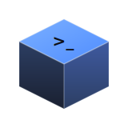

<p align="center">
  
</p>

<h1 align="center">Text2SCAD</h1>
<p align="center"><strong>Describe it. Make it.</strong></p>

<p align="center">
  
  
  
  
  
</p>

Chat with Claude to describe a 3D object in plain English, get back real OpenSCAD source, and watch it render live in an interactive 3D viewer. Ask for changes — "make the handle thicker", "add a hole through the base" — and the model updates in place.

## Demo


*Recorded end-to-end with the real app — see [`scripts/record-demo.mjs`](scripts/record-demo.mjs).*

## Quickstart

```bash
npm install                       # installs server + client workspaces
cp server/.env.example server/.env
# edit server/.env and set ANTHROPIC_API_KEY
npm run dev
```

Opens the Express API on `http://localhost:3001` and the Vite client on `http://localhost:5173` (proxies `/api/*` to the backend). Requires the [`openscad`](https://openscad.org/downloads.html) CLI on `PATH` and an Anthropic API key.

## How it works

```
┌────────────┐  streamed chat   ┌──────────────┐   spawns    ┌──────────┐
│   React     │ ───────────────▶│   Express     │────────────▶│ openscad │
│   client    │◀──── SSE ────── │   server      │             │   CLI    │
│ (chat + 3D  │                 │ (Anthropic     │◀── STL ────│          │
│  viewer)    │◀── STL blob ────│  SDK + render) │             └──────────┘
└────────────┘                 └──────────────┘
```

- **Chat → code**: the client streams the conversation to `POST /api/chat`; Claude replies with a short explanation plus one ` ```scad ` block, streamed back over SSE token-by-token.
- **Code → 3D**: each code block is posted to `POST /api/render`, which shells out to the real `openscad` binary for a binary STL, parsed client-side with three.js's `STLLoader` and shown via `@react-three/fiber`.
- Because rendering uses the real OpenSCAD CLI (not a JS reimplementation), the full OpenSCAD language and its exact rendering behavior are supported.

### Optimizations

Raw LLM-generated CSG code is prone to a specific failure: geometry that's syntactically valid but doesn't look like what was asked for (a floating handle, a foot that misses the ground) — and the model never sees a render of its own output. Three cheapest-first layers catch this:

| Layer | How it works | Why it works |
|---|---|---|
| **Curated helpers**<br>`helperLibrary.js` | Pre-verified modules (`rounded_box`, `capsule`, `tube`, `torus_arc`) prepended to every render, plus an "overlap, don't just touch" system-prompt rule. | Removes the need to hand-derive fragile transform math for every attachment — cheapest fix, applied on every turn. |
| **Mechanical connectivity check**<br>`meshAnalysis.js` | Union-find over shared STL vertices reports disconnected-piece count via an `X-Component-Count` header. If a part is genuinely floating, the client auto-sends a corrective follow-up (up to 2 attempts). | Catches truly disconnected geometry cheaply and automatically. Won't catch a part that's connected but shaped/oriented wrong — OpenSCAD's own `Volumes:` line looks like it'd help but reports the same count for a hollow object as for two separate ones, so it isn't used. |
| **Visual critique** (opt-in)<br>`POST /api/critique` | Renders a PNG snapshot server-side (OpenSCAD's fast OpenCSG preview path) and asks Claude, with vision, to judge and fix it. | The only layer that actually "looks" at the object, so it's the one that catches proportion/orientation defects. Opt-in since it costs a render + an extra model call. |

Multi-object scenes (a house plus trees plus animals) are the other bottleneck: STL export resolves every boolean exactly via CGAL, which scales badly once `hull()`-heavy helpers are involved. Measured on one representative scene: **2m 5s** naive → **2.3s** with `$fn` capped → **~1s** decomposed into parts.

| Optimization | How it works | Why it works |
|---|---|---|
| **Draft vs. final quality**<br>`openscadRenderer.js` | Every chat-turn render uses `quality: "draft"`, which caps `$fn` via a text-level substitution over literal `$fn=N` occurrences. Downloads trigger a fresh `quality: "final"` render on demand. | A CLI `-D` override alone doesn't work here: a per-primitive `$fn=24` (normal, idiomatic OpenSCAD, and what the system prompt itself encourages) always shadows a CLI default, so only a source-level substitution reliably caps detail. |
| **Scene decomposition**<br>`sceneParts.js` + `meshMerge.js` | The system prompt asks the model to mark independent top-level objects with a `// ===== SCENE PARTS =====` convention. Each part renders in its own temp file, in parallel (`SCENE_PART_CONCURRENCY`, default 4), and the STLs are concatenated directly. | Non-overlapping parts just need their triangle lists merged — no CGAL boolean required. The realism auto-fix also skips its disconnected-component check here, since multiple components is the correct topology for a scene. |

## Configuration

`server/.env` (see `server/.env.example`):

| Variable | Default | Description |
|---|---|---|
| `ANTHROPIC_API_KEY` | — | required |
| `CHAT_MODEL` | `claude-sonnet-5` | model used to generate/refine OpenSCAD code |
| `PORT` | `3001` | Express server port |
| `OPENSCAD_BIN` | `openscad` | path to the OpenSCAD binary |
| `RENDER_TIMEOUT_MS` | `20000` | kills a "draft" quality render past this long |
| `RENDER_TIMEOUT_MS_FINAL` | `90000` | kills a "final" quality render (on-demand, e.g. downloads) |
| `DRAFT_FN` | `8` | `$fn` cap applied to draft-quality renders |
| `SCENE_PART_CONCURRENCY` | `4` | how many SCENE PARTS to render in parallel |

`client/.env` only matters if you change the server's `PORT` — set `VITE_BACKEND_PORT` to match, since the dev server proxies `/api/*` to it (and uses `strictPort`, so it fails loudly instead of silently moving off `5173`).

## Project layout

```
server/                    Express API
  src/routes/chat.js          SSE streaming chat endpoint (Anthropic)
  src/routes/render.js        STL render endpoint (openscad CLI)
  src/routes/critique.js      PNG snapshot + vision critique endpoint
  src/lib/systemPrompt.js     system prompt + code-block extraction
  src/lib/openscadRenderer.js STL/PNG rendering via the openscad CLI
  src/lib/helperLibrary.js    curated OpenSCAD helper modules
  src/lib/meshAnalysis.js     STL connected-component check
  src/lib/sceneParts.js       SCENE PARTS marker detection/split
  src/lib/meshMerge.js        STL concatenation + concurrency helper

client/                    React + Vite + TypeScript frontend
  src/App.tsx                 layout, chat/render orchestration, auto-fix loop
  src/api/client.ts            SSE chat client, render + critique fetch helpers
  src/components/              chat bubbles, input, three.js viewer
```

## Notes / limitations

- Stateless backend — the full chat history is sent with every request, so conversation state lives in the browser only (lost on refresh).
- Generated code is restricted to core OpenSCAD; `include`/`use` of external libraries (MCAD, BOSL2, fonts) isn't available in the render sandbox.
- Each render runs in its own temp directory with a hard timeout, but `openscad` still executes arbitrary submitted source — don't expose this server to untrusted users without adding sandboxing (containers, seccomp, resource limits) in front of it.
